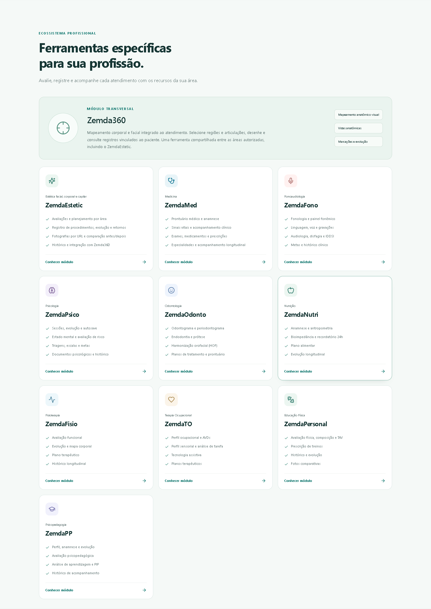
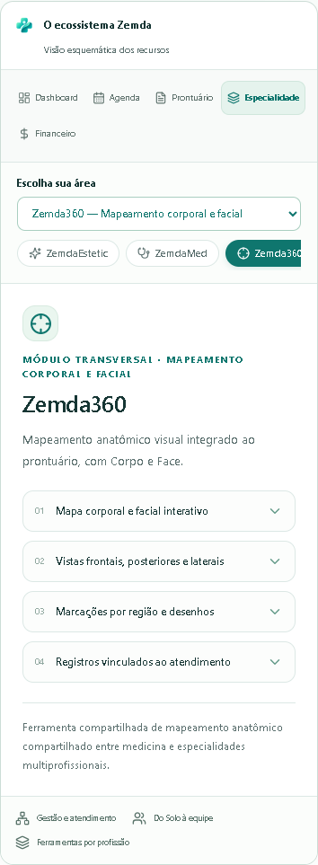

# Landing e migração de nomenclatura Zemda360

Base: `fb89de0` (main com ZemdaEstetic e Zemda360 já implementados). Branch: `codex/zemda360-landing`. Sem merge e sem publicação em produção.

## Escopo e arquitetura preservada

Esta atualização usa a implementação atual de Corpo/Face e o workspace ZemdaEstetic. Não recria mapas, não troca imagens, não altera geometria, caneta, borracha, observações, histórico, protocolos, paciente ou vínculo profissional. O trabalho independente anterior ficou preservado localmente em `codex/zemda360`, commit `0eff887`, e não foi sobreposto à implementação da main.

O Zemda360 continua um recurso compartilhado: imagem + overlay SVG + canvas, camadas por mapa/base/vista e documento JSON versionado em `body_assessments.notes`. ZemdaEstetic continua no diretório `estetic`, usando o mesmo modal anatômico: FACIAL → Face, CORPORAL → Corpo. A regra já existente para CAPILAR também foi preservada.

## Onde o nome antigo aparecia

Landing, demonstração interativa, rodapé, pré-renderização e páginas SEO; cadastro de clínica/profissão e ativação de teste; assinatura/benefícios; Fisioterapia; onboarding/ajuda; integrações do atendimento/prontuário; nomes de componentes, callbacks, contexto de autenticação, view de navegação e título persistido da capability BODY_MAP.

As interfaces passam a mostrar **Zemda360**. A Sidebar usa o nome curto. Rótulos históricos de módulo são normalizados apenas ao exibir, preservando o conteúdo original dos registros. Observações escritas pelo profissional não são reescritas.

## Componentes e identificadores

- `components/zemda-body` → `components/zemda360`, com imports atualizados em todos os consumidores.
- `ZemdaBodyCanvas`, `Workspace`, `RecordsView`, `Modal` e `Panel` → equivalentes `Zemda360*`, incluindo props/tipos e carregamento lazy.
- `isZemdaBody` → `isZemda360`; `onOpenZemdaBody` e estados de modal → nomes Zemda360.
- View interna `zemda-body` → `zemda360`; aba local `pain_zemdabody` → `pain_zemda360`, incluindo alvo do tour.
- `hasZemda360Access` é o nome canônico; `hasZemdaBodyAccess` continua como alias de exportação para integrações/testes antigos.
- Respostas de autenticação/cadastro/sandbox incluem `zemda360Enabled` e preservam `zemdaBodyEnabled`.

Nenhuma regra de autorização foi ampliada. Profissionais/gestores elegíveis continuam com acesso universal; isolamento por clínica, bloqueio de recepcionista/superadmin e profissional inativo permanecem.

## Rotas, APIs e persistência

| Elemento | Resultado |
|---|---|
| `/zemda360` | Rota canônica do aplicativo |
| `/mapa-corporal`, `/zemda-body` | Reconhecidas; URL substituída por `/zemda360` no cliente, preservando query/hash |
| `sessionStorage.activeView=zemda-body` | Normalizado ao restaurar navegação |
| `/#zemdabody` | Âncora antiga continua rolando até a seção `#zemda360` |
| `/mapa-corporal-clinico` | URL pública mantida; título, descrição e conteúdo atualizados |
| `/v1/body-assessments` e subrotas | Mantidas integralmente; nenhum endpoint clínico novo |
| `body_assessments`, `body_markers`, `body_drawings`, `zemda_body_enabled` | Nomes e dados preservados |
| `BODY_MAP` | ID/permissões mantidos; nome exibido atualizado para `Zemda360 (Mapa Anatômico)` no seed e em bancos existentes |
| `records.module_type`, `appointments.clinical_module` | Reconhecem `ZemdaBody` e `Zemda360` como recurso complementar; não bloqueiam módulo clínico principal |
| Tour persistido `zemda_body` | Mantido para preservar progresso; textos e destino novos |

A atualização idempotente de `capabilities.name` altera somente o rótulo legado de BODY_MAP. Não há alteração de schema nem migração destrutiva. APIs de auth/cadastro mantêm os campos antigos como aliases. Permissões persistidas não foram apagadas nem recriadas. Links públicos e sitemap não mudam de URL; por isso não foi necessário redirect HTTP público.

## Landing e SEO

ZemdaEstetic participa do mesmo array de módulos, cards, ícones Lucide, animações, tipografia, espaçamento, CTA e demonstração interativa já usados pelos demais módulos. O ecossistema passa a listar dez módulos profissionais, mais Zemda360 como ferramenta compartilhada.

Conteúdo validado no workspace/controller Estetic: avaliações facial/corporal/capilar, planos, procedimentos, evolução, retornos, histórico, fotos **cadastradas por URL** e comparação de pares antes/depois. Não é anunciado upload direto, diagnóstico automático ou funcionalidade futura.

A apresentação distingue:

- **ZemdaEstetic:** ambiente profissional de estética facial, corporal e capilar.
- **Zemda360:** mapeamento anatômico corporal e facial integrado ao atendimento, disponível às áreas autorizadas.

A mesma fonte `landingContent.ts` alimenta cards, rodapé e HTML pré-renderizado. SEO de Fisioterapia e mapa anatômico, benefícios comerciais e cadastro passam a usar Zemda360. A rota pública existente foi conservada.

## Validação executada

- Frontend: `npm --prefix frontend run build` (TypeScript + Vite), aprovado.
- Backend: `npm --prefix backend run build`, aprovado.
- `backend/test-zemda360.cjs`: persistência real SQLite, camadas Corpo/Face, autoria, dados antigos, exclusão, validação, papéis e isolamento, aprovado.
- `backend/test-zemda360-naming.cjs`: atualização de rótulo persistido, permissão antiga, aliases auth, módulo complementar antigo/novo e HTML pré-renderizado, aprovado.
- `backend/test-zemda-estetic.cjs`, com DATABASE_PATH temporário: seis testes aprovados (resolução profissional, permissões, registros e isolamento).
- `frontend/tests/zemda360-browser.cjs`: seleção de paciente, modelos/vistas corporais, seleção/articulações, dez imagens faciais, ATM, caneta/borracha, observação, salvar/reabrir/histórico em SQLite, leitura legada, toque em tablet, lazy loading e retry após erro, aprovado.
- `frontend/tests/zemda360-naming-browser.cjs`: rotas canônica/antigas no aplicativo, Sidebar com usuário legado, integração Estetic Facial → Face e Corporal → Corpo; sem erros JavaScript, aprovado.
- `frontend/tests/landing-browser.cjs`: onze demonstrações, 320/360/390/640/768/1024/1440 px, sem overflow, navegação, CTAs, FAQ, âncoras, ausência do nome antigo no texto e console, aprovado. Expectativas antigas do teste sobre CTAs/textos foram atualizadas para a Landing atual.
- `frontend/tests/landing-accordion-browser.cjs`: expansões, teclado, navegação e layout a 320/768/1440 px, aprovado.
- Revisão visual das capturas desktop/mobile; card Estetic segue os demais.
- `git diff --check` e auditoria global de nomenclatura.

**Limitação da suíte ampla:** `test-zemda-personal-and-body.cjs` terminou com 41 aprovações e 10 falhas, antes de concluir os cenários de mapa. Ela já está classificada como falha conhecida em `backend/run-tests.cjs`: depende de Worker/assinatura de arquivos e espera catálogo antigo de 119 exercícios. Também há expectativas antigas de acesso ao Personal. Não foi usada como evidência de aprovação; os testes específicos acima cobrem Zemda360. Nenhuma alteração fora do escopo foi feita para mascarar essas falhas.

Os testes usam dados fictícios e bancos temporários; não operam sobre registros de produção. Não houve deploy. O refinamento clínico/visual dos overlays existentes não pertence a esta atualização de nomenclatura e foi preservado como recebido na main.

## Auditoria e arquivos

A relação completa de ocorrências antigas remanescentes, com classificação, está em [legacy-audit.md](legacy-audit.md). Não restam rótulos comerciais ativos antigos no código auditado. Exceções são aliases, schema, migrações, fixtures/testes de legado e documentos originais preservados. `body` genérico (HTTP, DOM, anatomia corporal) não foi substituído.

O inventário de arquivos da entrega está em [changed-files.txt](changed-files.txt). Renames sem mudanças em geometria/artefatos aparecem como `R100` no diff do Git.
